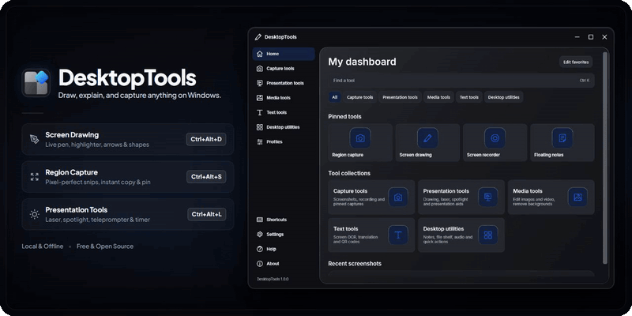
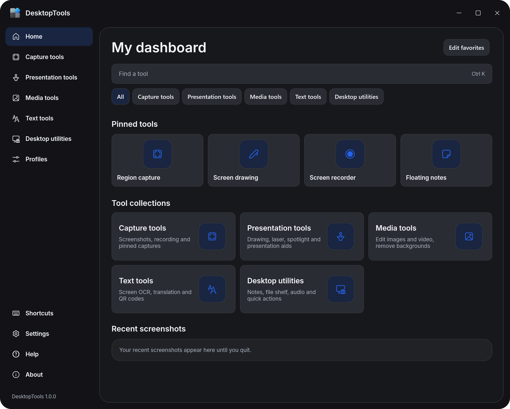
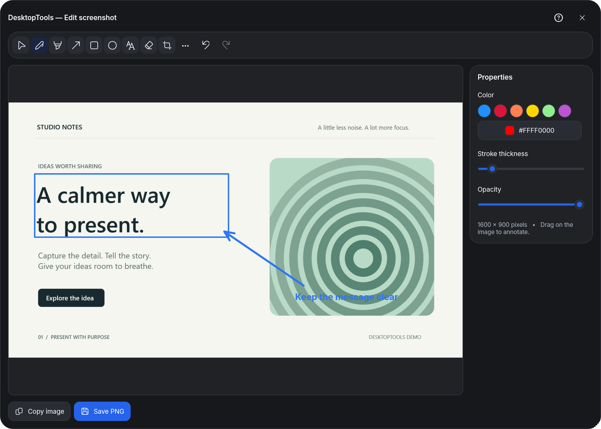
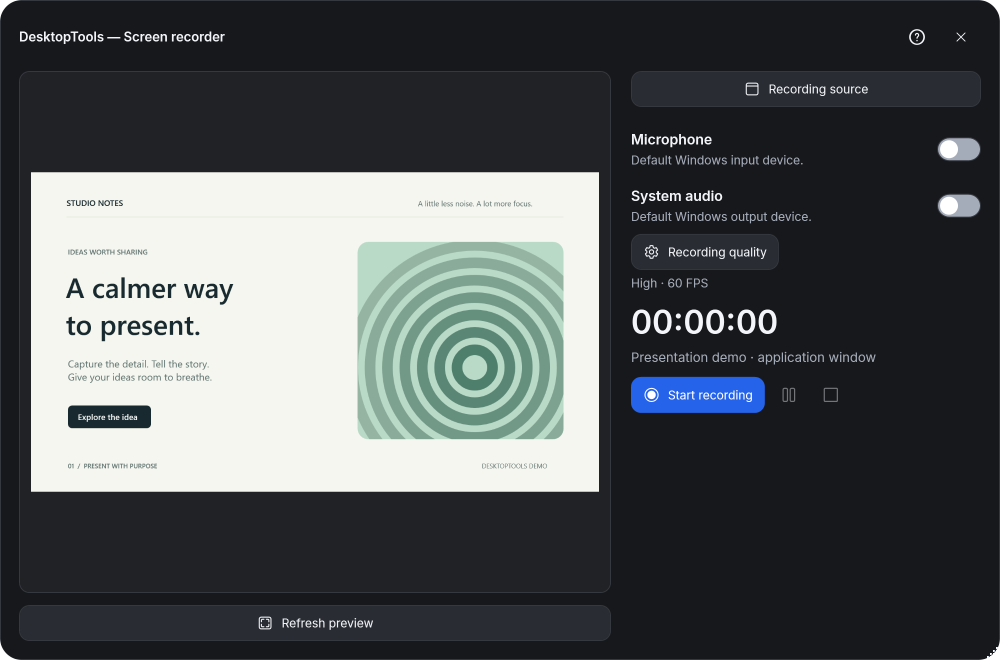

# DesktopTools



[English](README.md) · [Русский](README.ru.md) · [Deutsch](README.de.md) · [Français](README.fr.md) · [Español](README.es.md)

⭐ **¿Te gusta tener todas tus herramientas en un solo lugar? [Dale una estrella a DesktopTools en GitHub](https://github.com/vg2222/DesktopTools) y ayuda a que más personas lo descubran.**


[](https://github.com/vg2222/DesktopTools/releases/latest)
[](LICENSE)
[](docs/security-checks.md)

## Tu caja de herramientas para Windows: capturas, grabaciones, presentaciones y tareas cotidianas.

## 🚀 Consigue DesktopTools

[**Descargar para Windows →**](https://github.com/vg2222/DesktopTools/releases/latest) &nbsp; · &nbsp; [Versión portátil](https://github.com/vg2222/DesktopTools/releases/latest) &nbsp; · &nbsp; [Notas de la versión](https://github.com/vg2222/DesktopTools/releases/latest)

Windows 11 · 64 bits · No requiere instalar .NET por separado

Seguridad: [sumas de comprobación SHA-256](https://github.com/vg2222/DesktopTools/releases/latest/download/SHA256SUMS.txt) · [Verificar la descarga](docs/security-checks.md)

<sub>El instalador actual no está firmado, por lo que Windows SmartScreen puede mostrar un aviso. Se instala solo para tu cuenta de usuario y no requiere permisos de administrador.</sub>

---

## ✨ Una caja de herramientas, menos aplicaciones

**Desde una captura rápida hasta un recorrido completo.** Captura una zona, marca el detalle importante o graba una ventana con tu voz. Pasa de mostrar algo a explicarlo sin reunir una colección de aplicaciones independientes.

**Mantén la atención de tu audiencia.** Dibuja sobre la pantalla, señala con un puntero láser, ilumina un detalle o sigue el guion con un teleprónter y temporizadores.

**Resuelve también las tareas pequeñas.** Extrae texto de una captura, traduce entre inglés y ruso de forma local, ten tus notas a mano, genera un código QR o recorta una imagen antes de compartirla.

## 📸 Tres formas de empezar

### 🏠 Un hogar para tus herramientas de todos los días

Fija las que más usas y encuentra el resto en un solo lugar.



### ✏️ Explícalo con una captura de pantalla

Añade flechas, formas y texto; después, exporta una copia sin modificar el original.



### 🎬 Graba la vista adecuada

Elige un monitor, una ventana o una zona y configura el sonido y la calidad antes de grabar.



## 🔒 Diseñado para trabajar de forma local

Sin cuenta. Sin telemetría. Sin procesar tu contenido en la nube. Tus capturas, notas, reconocimiento de texto, traducciones entre inglés y ruso y eliminación de fondos se procesan en tu PC.

Tú eliges dónde guardar las imágenes y grabaciones. La comprobación automática de actualizaciones consulta GitHub para obtener información sobre las versiones; no sube tus archivos multimedia ni tus notas. Cambia el intervalo o desactiva las comprobaciones automáticas en **Configuración → Actualizaciones**.

Los controles de grabación y dibujo, las notificaciones, las notas flotantes y el teleprónter empiezan ocultos en las capturas compatibles. Los dibujos y efectos para la audiencia permanecen visibles. Ajusta cada herramienta en **Configuración → Privacidad**. La exclusión de elementos depende de la aplicación con la que grabes o compartas la pantalla; comprueba la vista que recibe la audiencia antes de confiar en ella.

## ⚙️ Hazlo tuyo

1. Instala DesktopTools o extrae el ZIP portátil y abre la aplicación.
2. Durante la configuración inicial, elige la apariencia, las herramientas y las preferencias para compartir la pantalla.
3. Fija tus herramientas favoritas y personaliza sus atajos.

DesktopTools permanece en el área de notificación cuando cierras la ventana principal. Haz clic en su icono para volver a abrirlo; elige **Salir** en el menú del icono para cerrar la aplicación.

| Acción | Atajo predeterminado |
| --- | --- |
| Dibujar / interactuar | Ctrl + Alt + D |
| Capturar una zona | Ctrl + Alt + S |
| Mostrar / ocultar los controles de dibujo | Ctrl + Alt + H |
| Puntero láser | Ctrl + Alt + L |
| Foco | Ctrl + Alt + O |
| Congelar fotograma | Ctrl + Alt + F |

La página **Atajos** muestra todas las asignaciones de funciones. Las asignaciones predeterminadas están activadas; las opcionales empiezan desactivadas. Cada asignación tiene su propio interruptor.

## 💡 Algunos detalles

La grabación de pantalla necesita Microsoft Visual C++ x64 Redistributable y Windows Media Foundation. Las frecuencias de grabación de hasta 144 FPS son objetivos; el rendimiento real depende de la fuente, el codificador y el hardware. Consulta la página de [compatibilidad](docs/compatibility.md) para conocer las limitaciones de captura y la cobertura actual de las pruebas. El instalador comprueba este componente y ofrece la página de descarga de Microsoft si es necesario.

La aplicación admite **inglés, ruso, alemán, francés y español**, además de los modos claro, oscuro y del sistema. Los idiomas de la interfaz son independientes del par de traducción inglés–ruso que se admite actualmente.

<details>
<summary><strong>🛠️ Compilar y contribuir</strong></summary>

Usa Windows 11 x64 y la versión del SDK de .NET fijada en [global.json](global.json). Descarga los modelos de traducción con sumas de comprobación fijadas y, a continuación, compila:

```powershell
./scripts/fetch-translation-models.ps1
./scripts/build.ps1
```

Consulta [Contribuir](CONTRIBUTING.md) para ejecutar las comprobaciones y proponer cambios, [Arquitectura](docs/architecture.md) para conocer la estructura del proyecto y [Actualizaciones](docs/updates.md) para preparar los paquetes de publicación.

</details>

## ⭐ Ayuda a mejorar DesktopTools

Si DesktopTools se ha ganado un sitio en tu escritorio, [dale una estrella](https://github.com/vg2222/DesktopTools). ¿Has encontrado algo que necesita atención? [Informa de un error](https://github.com/vg2222/DesktopTools/issues/new?template=bug_report.yml) o [solicita una función](https://github.com/vg2222/DesktopTools/issues/new?template=feature_request.yml).

[Licencia MIT](LICENSE) · [Avisos de terceros](THIRD-PARTY-NOTICES.md) · [Política de seguridad](SECURITY.md)
